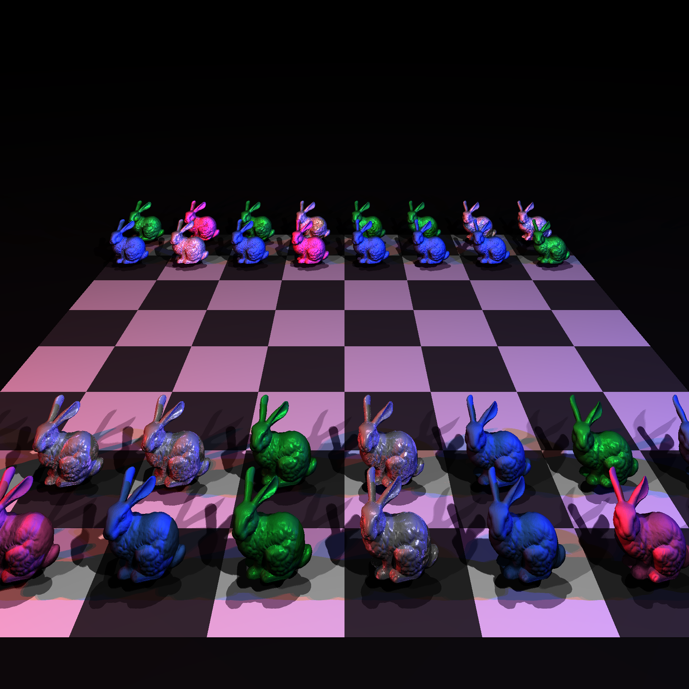
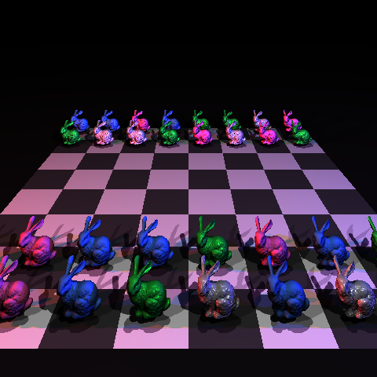

# CS 440 Project 2: Extended Ray Tracing Engine 

**Team Members:** Nehal Naeem Haji, Raahim Hashmi, Hania Kashif

---

## Scene Overview
Our final showcase is an isometric "Neon Chess" scene featuring 32 high-resolution Stanford Bunny models arranged on an 8x8 chessboard. Because each bunny consists of roughly 69,000 triangles, the scene contains **over 2.2 million primitives**. 

To capture the scene perfectly at 1920x1080 without aspect-ratio distortion, we implemented a custom "shift lens" camera technique by manipulating the physical Y-bounds of our viewplane. The scene is illuminated by a complex 5-point lighting setup, featuring standard key/fill/rim lights, paired with deep red and blue neon point lights on the X-axis to showcase the engine's handling of specular highlights and glossy reflections.

### High-Quality Render
<!-- Upload your final 1920x1080 render to an 'images' folder and uncomment the line below -->

*Resolution: 1920x1920*

### Low-Quality Render
<!-- Upload your fast 480x360 render to an 'images' folder and uncomment the line below -->

*Resolution: 480x360*

---

## Implementation Features
Here are the features implemented in our ray tracing engine:
* **Homework 5 Base:** Spheres, Planes, Triangles, Basic Cosine Shading.
* **Acceleration:** Bounding Volume Hierarchy (BVH) for optimized spatial partitioning.
* **Materials (BRDFs):** Diffuse (Matte), Specular Mirror (Reflective), and Glossy Plastic (Phong).
* **Lighting:** Point lights, Directional lights, and multi-colored lighting arrays.
* **Tracers:** Basic ray casting and secondary Shadow rays with acne-prevention offsets.
* **Sampling:** Jittered sampling for anti-aliasing and Simple sampling for fast rendering.
* **Camera:** Perspective viewing with wide-angle and shift-lens capabilities.

---

## Acceleration Analysis
We implemented a Bounding Volume Hierarchy (BVH) to speed up rendering. Without spatial partitioning, calculating intersections for 2.2 million triangles per pixel would make rendering practically impossible. Below is the performance comparison for our showcase scene.

| Metric | Without BVH (Brute Force) | With BVH |
| :--- | :--- | :--- |
| **Render Time** | 4 Hours | ~5 Minutes |

<!-- Upload your BVH comparison image if you have one, and uncomment below -->
<!--  -->

---

## Build Details
The following `World::build` functions generate the images seen on this page:
* `buildBunny.cpp` - Generates the High-Quality "Neon Chess" showcase render.
* `buildBVHTest.cpp` - Generates the Acceleration comparison image.

---

## Team Contributions
* **Nehal Naeem Haji:** Implemented the BVH Acceleration structure and the Basic/Shadow Tracers.
* **Raahim Hashmi:** Implemented the BRDFs and Material hierarchy.
* **Hania Kashif:** Implemented the Light hierarchy, Anti-aliasing Samplers, and designed the final scene.

---

## References
* [The Stanford 3D Scanning Repository (Stanford Bunny)](http://graphics.stanford.edu/data/3Dscanrep/)
* [Physically Based Rendering: From Theory to Implementation (Pharr, Jakob, Humphreys)](https://pbr-book.org/)